# MyAgent - Architecture Diagram

Paste this code into [Mermaid Live Editor](https://mermaid.live) or any Mermaid renderer.

```mermaid
%%{init: {'theme': 'dark', 'themeVariables': {'primaryColor': '#1e40af', 'primaryTextColor': '#f8fafc', 'primaryBorderColor': '#3b82f6', 'lineColor': '#64748b', 'secondaryColor': '#0f172a', 'tertiaryColor': '#1e293b', 'background': '#0f172a', 'mainBkg': '#1e293b', 'nodeBorder': '#475569', 'clusterBkg': '#1e293b', 'clusterBorder': '#334155', 'titleColor': '#f8fafc', 'edgeLabelBackground': '#1e293b'}}}%%

flowchart TD
    %% ============================================
    %% USER LAYER
    %% ============================================
    subgraph USER["🌐 USER INTERFACE"]
        direction LR
        U_TEXT["⌨️ Text Input"]
        U_VOICE["🎤 Voice Input"]
        U_IMAGE["📷 Image Upload"]
        U_LANG["🌍 7 Languages<br/>ES EN FR PT DE IT ZH"]
    end

    %% ============================================
    %% FRONTEND
    %% ============================================
    subgraph FRONTEND["🖥️ FRONTEND — Next.js 14 + Tailwind CSS"]
        direction LR
        F_CHAT["💬 Chat Panel<br/>+ Markdown render"]
        F_WORKFLOW["⚙️ Workflow Panel<br/>Real-time steps"]
        F_ANALYTICS["📊 Analytics Dashboard<br/>Charts + PDF export"]
        F_TRANSACTIONS["💰 Transaction Log<br/>Live commissions"]
        F_SSE["📡 SSE Client<br/>Event streaming"]
    end

    %% ============================================
    %% BACKEND API
    %% ============================================
    subgraph BACKEND["⚡ BACKEND — FastAPI + Python 3.11"]
        direction TB
        
        subgraph SECURITY["🛡️ DUAL-LAYER GUARDRAILS"]
            direction LR
            G_INPUT["🔒 Input Validator<br/>Regex patterns"]
            G_ML["🧠 ML Content Filter<br/>Qwen Cloud classifier"]
            G_OUTPUT["🔐 Output Sanitizer<br/>Data masking"]
        end

        subgraph ORCHESTRATION["🎯 ORCHESTRATION — LangGraph"]
            direction TB
            SUPERVISOR["🧭 SUPERVISOR<br/>qwen3.5-omni-plus<br/>Multilingual Router"]
            
            subgraph AGENTS["🤖 SPECIALIZED AGENTS"]
                direction LR
                A_ENERGY["⚡ Energy<br/>omni-flash<br/>Tariffs · Savings · Contracts"]
                A_LOGISTICS["📦 Logistics<br/>omni-flash<br/>Packages · Deliveries · Returns"]
                A_SUPPORT["💬 Support<br/>omni-flash<br/>Recharges · PINs · RAG"]
                A_VISUAL["👁️ Visual<br/>vl-max<br/>Bills · Labels · OCR"]
                A_ANALYTICS["📊 Analytics<br/>omni-flash<br/>Metrics · Trends · Reports"]
            end

            subgraph SOCIETY["🏛️ AGENT SOCIETY — Strategic Debate"]
                direction LR
                S_SALES["💼 Sales"]
                S_MARKETING["📢 Marketing"]
                S_OPS["⚙️ Operations"]
                S_FINANCE["📊 Finance"]
                S_MOD["🎯 Moderator"]
            end
        end

        subgraph MCP_LAYER["📡 MCP PROTOCOL — 5 Servers · 20 Tools"]
            direction TB
            subgraph MCP_E_BOX["⚡ myagent-energia (3 tools)"]
                direction LR
                T_E1["🔧 calcular_ahorro_energetico<br/>Compare tariffs · Calculate savings"]
                T_E2["🔧 preparar_contrato_energia<br/>Draft energy contract"]
                T_E3["🔧 consultar_tarifas_disponibles<br/>List all tariffs"]
            end
            subgraph MCP_L_BOX["📦 myagent-logistica (5 tools)"]
                direction LR
                T_L1["🔧 registrar_paquetes<br/>Register incoming packages"]
                T_L2["🔧 confirmar_entrega_paquete<br/>Verify delivery (PIN/DNI)"]
                T_L3["🔧 consultar_estado_paquete<br/>Track package status"]
                T_L4["🔧 gestionar_devolucion<br/>Process returns"]
                T_L5["🔧 listar_paquetes_pendientes<br/>Pending inventory"]
            end
            subgraph MCP_C_BOX["💬 myagent-catalogo (4 tools)"]
                direction LR
                T_C1["🔧 procesar_recarga<br/>Phone recharges (13 countries)"]
                T_C2["🔧 activar_pin_digital<br/>Digital PINs (19 platforms)"]
                T_C3["🔧 buscar_en_manuales<br/>RAG knowledge search"]
                T_C4["🔧 consultar_catalogo_productos<br/>120+ products catalog"]
            end
            subgraph MCP_M_BOX["🧠 myagent-memory (4 tools)"]
                direction LR
                T_M1["🔧 store_memory<br/>Save cross-session memory"]
                T_M2["🔧 recall_memories<br/>Retrieve relevant context"]
                T_M3["🔧 forget_memory<br/>Intelligent forgetting"]
                T_M4["🔧 get_memory_summary<br/>Memory overview"]
            end
            subgraph MCP_A_BOX["📊 myagent-analytics (4 tools)"]
                direction LR
                T_A1["🔧 get_daily_summary<br/>Transactions & commissions"]
                T_A2["🔧 get_top_products<br/>Best performers ranking"]
                T_A3["🔧 get_commission_trend<br/>Revenue over time"]
                T_A4["🔧 compare_periods<br/>Growth vs previous period"]
            end
        end

        subgraph MEMORY_LAYER["🧠 MEMORY ENGINE"]
            direction LR
            MEM_SESSION["💭 Session Memory<br/>In-conversation context"]
            MEM_PERSIST["🗄️ Persistent Memory<br/>Cross-session · TTL · Relevance"]
            MEM_CONT["🔄 Continuation Mode<br/>Smart follow-ups"]
        end
    end

    %% ============================================
    %% DATA LAYER
    %% ============================================
    subgraph DATA["🗄️ DATA LAYER"]
        direction LR
        DB_PG["🐘 PostgreSQL 16<br/>+ pgvector<br/>Transactions · Analytics · Memories"]
        DB_REDIS["⚡ Redis 7<br/>Session cache · Rate limiting<br/>Response cache"]
        DB_RAG["📚 RAG Knowledge Base<br/>Operational manuals<br/>Vector similarity search"]
        DB_REF["📋 Reference Data<br/>120+ products · 8 tariffs<br/>12 carriers · 13 countries"]
        DB_OSS["📁 OSS (Object Storage)<br/>Image uploads · Documents<br/>Visual agent files"]
    end

    %% ============================================
    %% ALIBABA CLOUD INFRASTRUCTURE
    %% ============================================
    subgraph ALIBABA["☁️ ALIBABA CLOUD INFRASTRUCTURE"]
        direction LR
        ALI_VPC["🔒 VPC<br/>172.16.0.0/16<br/>Private Network"]
        ALI_SG["🛡️ Security Group<br/>Ports: 22 · 80 · 443<br/>3000 · 8000"]
        ALI_ECS["🖥️ ECS Instance<br/>2vCPU · 4GB RAM<br/>Ubuntu 24.04<br/>Docker Compose"]
        ALI_OSS["📁 OSS Bucket<br/>myagent-hackaton-2026<br/>Image & Doc storage"]
        ALI_SLS["📊 Log Service (SLS)<br/>myagent-logs<br/>Centralized logging"]
    end

    %% ============================================
    %% EXTERNAL SERVICES
    %% ============================================
    subgraph EXTERNAL["🌐 EXTERNAL SERVICES"]
        direction LR
        QWEN["🧠 Qwen Cloud<br/>DashScope API<br/>30+ models"]
        LANGSMITH["📈 LangSmith<br/>Traces · Monitoring<br/>Project: hackaton-enterprise"]
    end

    subgraph QWEN_MODELS["Qwen Cloud — Model Router (16 models/role)"]
        direction TB
        QM1["qwen3.6-flash / qwen3.6-plus<br/>Primary agents"]
        QM2["qwen3.5-flash / qwen-flash / qwen-turbo<br/>Fallback chain"]
        QM3["qwen-vl-max / qwen3-vl-plus<br/>Vision models"]
        QM4["text-embedding-v4<br/>RAG embeddings"]
        QM5["deepseek-v4-flash / glm-5.2 / qwen-max<br/>Extended fallbacks"]
    end

    %% ============================================
    %% CONNECTIONS
    %% ============================================
    
    %% User to Frontend
    U_TEXT --> F_CHAT
    U_VOICE --> F_CHAT
    U_IMAGE --> F_CHAT
    U_LANG --> F_CHAT

    %% Frontend to Backend
    F_CHAT -->|"SSE Stream"| F_SSE
    F_SSE -->|"POST /api/stream/chat"| SECURITY
    F_ANALYTICS -->|"GET /api/analytics/*"| BACKEND
    F_WORKFLOW -.->|"Real-time events"| F_SSE

    %% Security flow
    G_INPUT -->|"Pass"| G_ML
    G_ML -->|"Safe"| SUPERVISOR
    SUPERVISOR -->|"Route"| AGENTS
    SUPERVISOR -->|"Strategy query"| SOCIETY

    %% Agents to MCP
    A_ENERGY --> MCP_E_BOX
    A_LOGISTICS --> MCP_L_BOX
    A_SUPPORT --> MCP_C_BOX
    A_ANALYTICS --> MCP_A_BOX
    A_SUPPORT --> MCP_M_BOX

    %% Society internal
    S_SALES & S_MARKETING & S_OPS & S_FINANCE -->|"Round 1 & 2"| S_MOD

    %% MCP to Data
    MCP_E_BOX --> DB_REF
    MCP_L_BOX --> DB_REF
    MCP_C_BOX --> DB_RAG
    MCP_M_BOX --> MEM_PERSIST
    MCP_A_BOX --> DB_PG

    %% Memory connections
    MEM_SESSION --> DB_REDIS
    MEM_PERSIST --> DB_PG

    %% Backend to External
    AGENTS -->|"LLM calls<br/>(Model Router)"| QWEN
    A_VISUAL -->|"Multimodal"| QWEN
    SOCIETY -->|"10 LLM calls<br/>per debate"| QWEN
    ORCHESTRATION -.->|"Traces"| LANGSMITH
    ORCHESTRATION -.->|"Logs"| ALI_SLS
    QWEN --> QWEN_MODELS

    %% Infrastructure
    BACKEND -->|"Runs on"| ALI_ECS
    DATA -->|"Docker volume"| ALI_ECS
    DB_OSS -->|"Alibaba Cloud"| ALI_OSS
    ALI_ECS --> ALI_VPC
    ALI_VPC --> ALI_SG

    %% Output flow
    AGENTS -->|"Response"| G_OUTPUT
    G_OUTPUT -->|"SSE events"| F_SSE
    G_OUTPUT -->|"Save"| DB_PG
    F_SSE -->|"Update UI"| F_CHAT
    F_SSE -->|"Update"| F_TRANSACTIONS
    F_SSE -->|"Update"| F_WORKFLOW

    %% Styling
    classDef userStyle fill:#1e40af,stroke:#3b82f6,color:#f8fafc
    classDef frontendStyle fill:#0d9488,stroke:#14b8a6,color:#f8fafc
    classDef securityStyle fill:#dc2626,stroke:#ef4444,color:#f8fafc
    classDef agentStyle fill:#7c3aed,stroke:#8b5cf6,color:#f8fafc
    classDef societyStyle fill:#be185d,stroke:#ec4899,color:#f8fafc
    classDef mcpStyle fill:#d97706,stroke:#f59e0b,color:#f8fafc
    classDef dataStyle fill:#065f46,stroke:#10b981,color:#f8fafc
    classDef cloudStyle fill:#1e3a5f,stroke:#0ea5e9,color:#f8fafc
    classDef externalStyle fill:#4c1d95,stroke:#7c3aed,color:#f8fafc

    class U_TEXT,U_VOICE,U_IMAGE,U_LANG userStyle
    class F_CHAT,F_WORKFLOW,F_ANALYTICS,F_TRANSACTIONS,F_SSE frontendStyle
    class G_INPUT,G_ML,G_OUTPUT securityStyle
    class A_ENERGY,A_LOGISTICS,A_SUPPORT,A_VISUAL,A_ANALYTICS,SUPERVISOR agentStyle
    class S_SALES,S_MARKETING,S_OPS,S_FINANCE,S_MOD societyStyle
    class T_E1,T_E2,T_E3,T_L1,T_L2,T_L3,T_L4,T_L5,T_C1,T_C2,T_C3,T_C4,T_M1,T_M2,T_M3,T_M4,T_A1,T_A2,T_A3,T_A4 mcpStyle
    class DB_PG,DB_RAG,DB_REF,DB_REDIS,DB_OSS dataStyle
    class ALI_VPC,ALI_SG,ALI_ECS,ALI_OSS,ALI_SLS cloudStyle
    class QWEN,LANGSMITH,QM1,QM2,QM3,QM4,QM5 externalStyle
```

## Key Metrics

| Component | Count |
|-----------|-------|
| Specialized Agents | 7 |
| MCP Servers | 5 |
| MCP Tools | 20 |
| LLM Models (failover chain) | 30+ |
| Supported Languages | 7 |
| Products in Catalog | 120+ |
| Alibaba Cloud Services | 6 (ECS, VPC, OSS, SLS, Redis, Qwen Cloud) |
| Hackathon Tracks | 3 (Autopilot + Memory + Society) |
